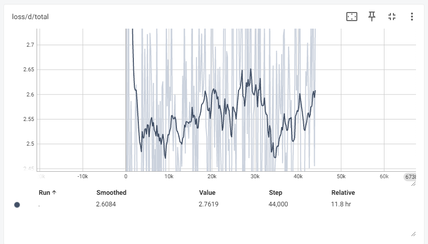

# Bert-VITS2-Korean

[fishaudio/Bert-VITS2](https://github.com/fishaudio/Bert-VITS2)의 한국어 구현을 시도중입니다

현재 제대로 된 한국어 학습이 **불가능**하며, 이 repository는 참고용으로만 활용하시기 바랍니다.

본 repository는 Bert-VITS2의 한국어 구현과 한국어 음성 합성 분야의 발전을 위해 공유되었습니다.

[정보교류용 DISCORD 서버 링크](https://discord.gg/fuwUZdmQAW)

## 본 repository의 주요 변경점
- 한국어 BERT모델로 [beomi/kcbert-large](https://huggingface.co/beomi/kcbert-large)를 사용

원래 [team-lucid/deberta-v3-base-korean](https://huggingface.co/team-lucid/deberta-v3-base-korean)를 사용하려 했으나, 기존 [fishaudio/Bert-VITS2](https://github.com/fishaudio/Bert-VITS2)코드에서 hidden_size가 1024인 BERT모델을 사용하여 일관성을 위해 변경 결정

- [text/korean.py](./text/korean.py) 코드 추가

[FENRlR/MB-iSTFT-VITS2](https://github.com/FENRlR/MB-iSTFT-VITS2)에서 사용된 기존 vits 한국어 코드를 활용해 g2p함수 작성, 한국어에는 성조가 없기에 tones를 전부 0으로 설정

- [text/korean_bert.py](./text/korean_bert.py) 코드 추가

기존 코드 그대로 사용

- [train_ms.py](./train_ms.py), [models.py](./models.py), [data_utils.py](./data_utils.py) 등 학습 코드에서 ko_bert 관련 가중치 항목 추가

- (2024.04.07 추가) 학습 효율을 위해 [train_ms.py](./train_ms.py), [models.py](./models.py), [data_utils.py](./data_utils.py) 등 학습 코드에서 한국어를 제외한 영어, 중국어, 일본어 관련 가중치 삭제

## 학습 관련 명령어 모음

```
#학습 전 config.yml 수정이 필요합니다(dataset_path 항목, 상대경로 설정)
#또한, microsoft/wavlm-base-plus의 pytorch_model.bin 파일이 slm/wavlm-base-plus 내부에 있어야 학습이 가능합니다.

#1. 오디오 리샘플링
python resample.py

#2. 음성 전사 텍스트 전처리
python preprocess_text.py
#config.yml의 transcription_path의 데이터가 전처리되어 train/val가 자동으로 나눠집니다.

#3. 텍스트에 대한 BERT모델의 hidden_state값 저장
python bert_gen.py

#4. 학습 시작
python train_ms.py
```

## 학습 과정 공유

```./tensorboard```에서 학습 log를 확인할 수 있습니다.


### 초기 코드



[초기 코드](https://github.com/jwj7140/Bert-VITS2-Korean/commit/438803f92e32b129cdd52c1e90fd7cf98832cfcd)에서의 loss그래프입니다.


### (2024.04.07 추가) 한국어를 제외한 영어, 일본어, 중국어 관련 가중치 삭제


보이는대로, 현재 제대로 된 한국어 학습이 진행되지 않고 있습니다. 더 수정이 필요합니다.
